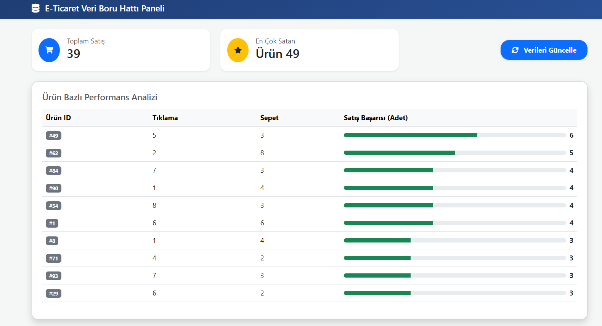

📊 End-to-End E-Commerce Data Pipeline & Dashboard
Bu proje, gerçek zamanlı veri üretiminden görselleştirmeye kadar uzanan profesyonel bir Veri Mühendisliği (Data Engineering) iş akışını simüle eder. Docker konteynerları üzerinde çalışan sistem, ham e-ticaret verilerini işler, analiz eder ve bir web arayüzü üzerinden sunar.

🚀 Proje Mimarisi
Data Generator: Python ile rastgele "tıklama, sepete ekleme ve satın alma" olayları üreten script.

Database: Tüm ham verilerin depolandığı PostgreSQL (Docker üzerinde).

Orchestration: İş akışının zamanlanması ve yönetilmesi için Apache Airflow.

Visualization: Analiz sonuçlarını sunan modern Flask tabanlı Dashboard.

🛠️ Kullanılan Teknolojiler
Dil: Python 3.x

Veritabanı: PostgreSQL 15

Konteynerizasyon: Docker & Docker Compose

İş Akışı Yönetimi: Apache Airflow

Web Framework: Flask & Bootstrap 5

📈 Dashboard Görünümü
Not: Proje, 32-bit sistem kısıtlamaları göz önünde bulundurularak optimize edilmiş ve Flask ile yüksek performanslı bir görselleştirme katmanı sunulmuştur.

⚙️ Kurulum ve Çalıştırma
Sistemi Başlatın:

Bash
docker-compose up -d
Veri Üretimini Başlatın:

Bash
python data_generator.py
Dashboard'u Açın:

Bash
python app.py
Ardından tarayıcınızdan http://localhost:5000 adresine gidin.

